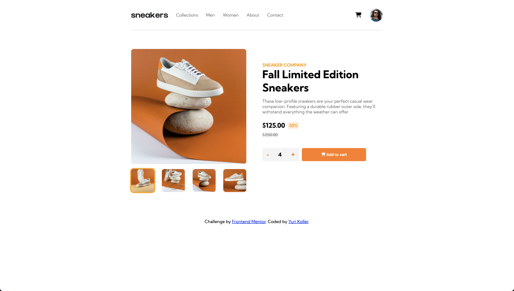

# Frontend Mentor - E-commerce product page solution

This is a solution to the [E-commerce product page challenge on Frontend Mentor](https://www.frontendmentor.io/challenges/ecommerce-product-page-UPsZ9MJp6). Frontend Mentor challenges help you improve your coding skills by building realistic projects.

## Table of contents

- [Frontend Mentor - E-commerce product page solution](#frontend-mentor---e-commerce-product-page-solution)
  - [Table of contents](#table-of-contents)
  - [Overview](#overview)
    - [The challenge](#the-challenge)
    - [Screenshot](#screenshot)
    - [Links](#links)
  - [My process](#my-process)
    - [Built with](#built-with)
    - [What I learned](#what-i-learned)
    - [Continued development](#continued-development)
    - [Useful resources](#useful-resources)
  - [Author](#author)
  - [Acknowledgments](#acknowledgments)

## Overview

### The challenge

Users should be able to:

- View the optimal layout for the site depending on their device's screen size
- See hover states for all interactive elements on the page
- Open a lightbox gallery by clicking on the large product image
- Switch the large product image by clicking on the small thumbnail images
- Add items to the cart
- View the cart and remove items from it

### Screenshot



### Links

- Solution URL: [GitHub page](https://github.com/rnsnceman/ecommerce-product-page)
- Live Site URL: [Live Site](https://rnsnceman.github.io/ecommerce-product-page/)

## My process

### Built with

- Semantic HTML5 markup
- CSS custom properties
- Flexbox
- [React](https://reactjs.org/) - JS library

### What I learned

I'm happy with both the mobile and desktop carousel I created for the first time from scratch:

```css
.top > img {
width: 100vw;
  margin: 0;
  position: relative;
  border-radius: 0;
  object-fit: cover;

}

.top {
  margin: 0;
  padding: 0;
  max-width: 100vw;
  display: flex;
  position: relative;
  height: clamp(400px, 80vw, 600px);
}
```
```js
setCarousel(
          <div className="top side">
            
            
            
            
            <div className="left-arrow" onClick={scrollLeft}><FontAwesomeIcon icon={faArrowLeft} /></div>
            <div className="right-arrow" onClick={scrollRight}><FontAwesomeIcon icon={faArrowRight} /></div>
          </div>
        );
```

### Continued development

I hope to learn more about the backend process such as API and MondoDB.

### Useful resources

- [W3Schools](https://www.w3schools.com/) - This helped me whenever I needed a reminder of a function.
- [MDN Web Docs](https://developer.mozilla.org/) - This also helped me whenever I needed a reminder of a function.

## Author

- Frontend Mentor - [@rnsnceman](https://www.frontendmentor.io/profile/rnsnceman)
- Instagram - [@yurikoller](https://www.instagram.com/yurikoller)

## Acknowledgments

Thank you to Frontendmentor for providing the challenges.